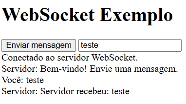

# Exemplo Simples de WebSocket

Este projeto demonstra uma aplicação WebSocket simples usando Node.js e JavaScript no navegador. Ele inclui um servidor WebSocket e um cliente web com um botão de trigger para enviar mensagens.

## Como funciona
- O servidor WebSocket é implementado em Node.js (arquivo `server.js`).
- O cliente web (arquivo `public/index.html`) permite enviar mensagens para o servidor através de um botão (trigger).
- O servidor responde a cada mensagem recebida.

## Exemplo de Trigger

## Exemplo de Comunicação WebSocket

